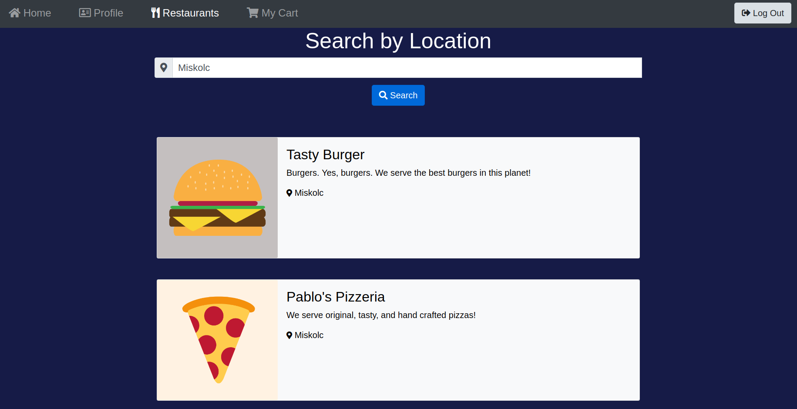

# CodeMates (Front end)
> A food delivering service where costumers can browse the products of restaurants by location and order meals, Couriers are waiting for orders to pick up and deliver it to the costumer's address!



## Details

### Repository urls
The web application is split into two projects :  
- [Front end with Angular](https://github.com/PeterOrliczki/CodeMatesAngular)  
- [Back end with Java, Spring and PostgreSQL](https://github.com/PeterOrliczki/CodeMatesSpring)

### About the project
The project is currently under development, right now is at the third sprint with SCRUM methodology.   
The project's back end was made with Java, Spring, and PostgreSQL.   The web app uses Spring MVC for RESTful services and Spring's Hibernate for JPA implementation.   It's a single page web application were DOM manipulation and asynchronous method execution is done with Angular.   

## Deploying and Running

### Prerequisites
- Angular CLI
- Java 
- PostgreSQL
- Maven

### Deploying and running the front end
OS X & Linux:
```sh
ng serve -o
```

### Deploying and running the back end
OS X & Linux:
```sh
mvn spring-boot:run
```
### Note
After the running and deploying for both the front end and the back end, the web app application will run in the browser under http://localhost:4200/ url.

## Developers
- tarapeti
- zeeKovacs
- PeterOrliczki
- imgergopapp
